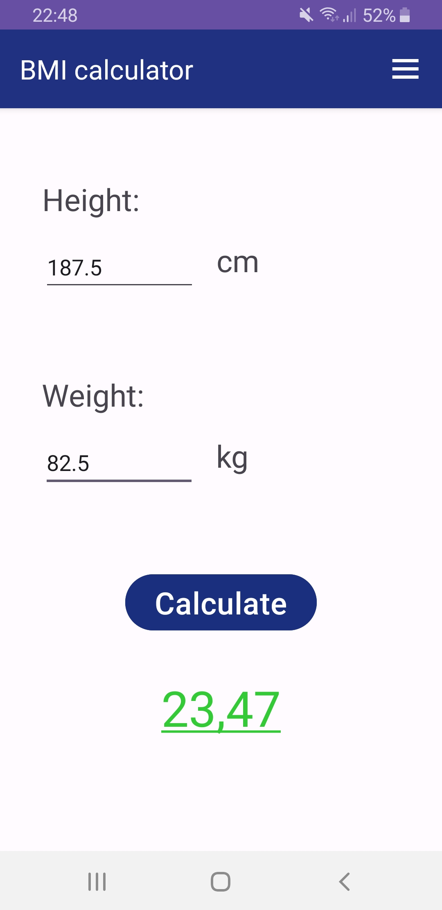
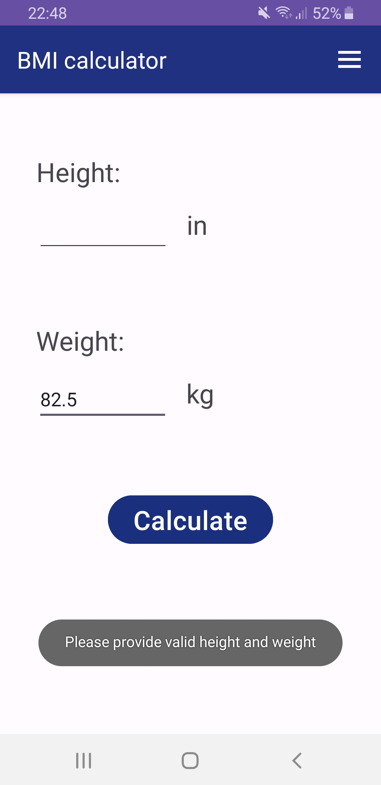
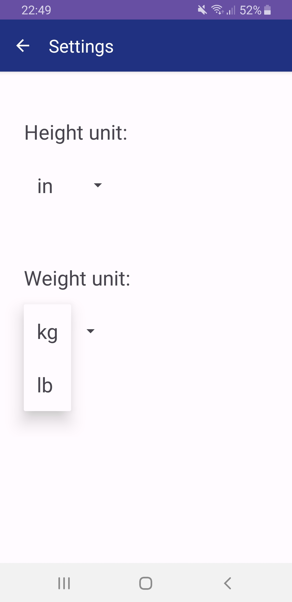
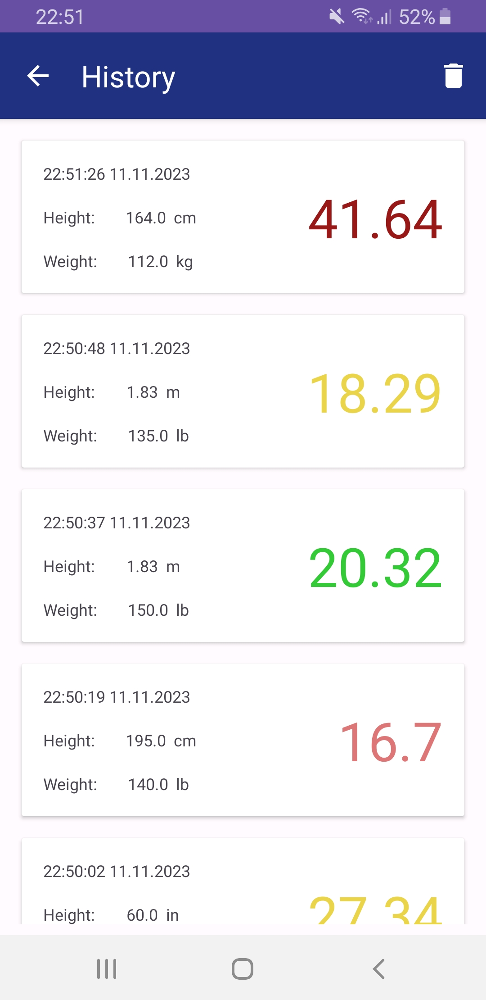
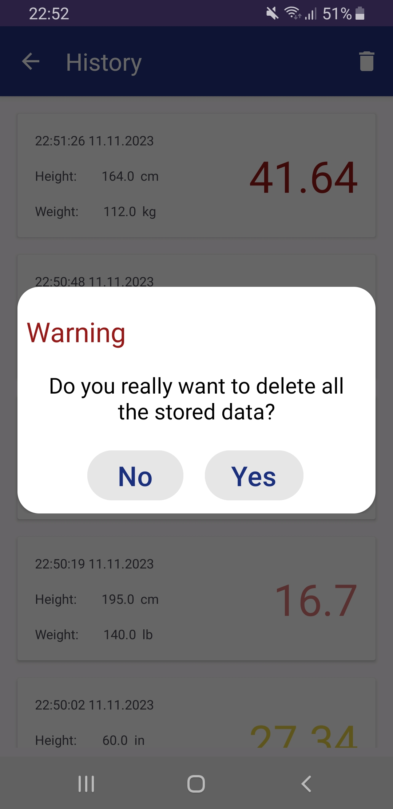

# BMI app

## Introduction
This app was created for the Mobile Applications course. Main features that were required to implement:
- app should allow to select the units (input fields should be cleared after such change),
- color of the BMI score should be changing accordingly to the category that this result belongs to (and should be inaffected by the screen rotation),
- app should have a history of the last 10 calculated BMIs with their date, weight and height values and the score,
- calculated score should have a corresponding description of the BMI category,
- app should have a page about the author.

## Demo
Here are some screenshots presenting the basic usage of the app.  

  
  
  

  
  
  

## Implementation details
This application uses the MVVM architectural pattern.  
  
`MainActivity` has a reference to the `MainViewModel` which is responsible for:
- communicating with the `UnitAdapter` to retrieve the currently selected units,
- updating height and weight values (and BMI score if needed),
- communicating with the `BMIcalculator` to get the properly calculated BMI score after passing height and weight values and proper scaling factors for the selected units retrieved from the `UnitAdapter`
- communicating with the `HistoryHandler` in order to add new entries to the history.

`MainActivity`:
- implements the Observator design pattern to observe the `bmi_value()` function (from the `MainViewModel`) which returns a `LiveData<Double?>`.
- offers the user a menu to start new activities,
- controlls the UI components in order to properly react for the changes by notifying `MainViewModel`.

`UnitAdapter`:
- stores two maps with keys being the names of the height and weight units and values being the scaling factors of those units to the SI units (*m* and *kg*),
- uses *SharedPreferences* to store selected units by the user,
- provides an easy access to the unit and its scaling factor for the other classes.

`BMIcalculator` - implements a formula to calculate the BMI score. It is a separate object hence it is easy to find that formula and adjust it if needed.

`HistoryHandler`:
- uses *SharedPreferences* to permanently store the list of 10 last entries as a *StringSet* (entries are serialized to the JSON format first and then added to the set),
- provides a `loadSortedHistoryList()` function that loads stored set, changes it into a `mutableListOf<HistoryEntry>` by deserializing each entry and sorts the list in a descending chronological order,
- provides an `addEntry()` function that takes care about adding new entries while not exceeding the size limit of the list.

`DescriptionProvider` - this object is responsible for providing data about each BMI category. It has four maps - each of them maps the *category ID* to respectively: *category name*, *category upper bound*, *category color* and *category description*. It has a function that returns a category ID based on the BMI score passed as an argument. Then this function is used to get the other properties related to the category based only on the BMI score.

`History` activity uses a RecyclerView with a custom `RecyclerAdapter` to display previously calculated entries.

`Settings` displays the spinners to let the user select the unit. After such a selection it notifies the `UnitAdapter` about the change.
